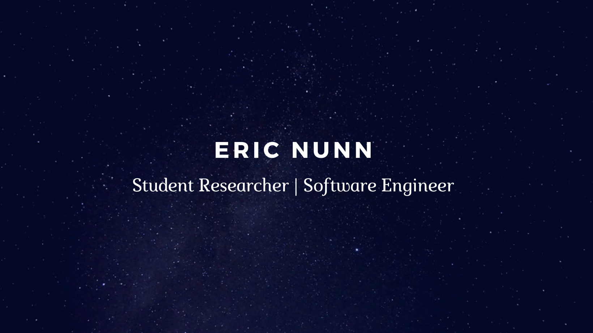

<h2 align="center">Welcome to my GitHub! </h2>

### Who Am I?

- 🏫 Graduate computer science student at Seattle University
- ✈️ Equipment Engineer at Boeing working with large-scale R&D autoclaves and military flight-line equipment
- 👨‍🏫 Grader for Machine Learning course (Spring 21 - Seattle University)

[LinkedIn](https://www.linkedin.com/in/eric-j-nunn)
|
[Twitter](https://twitter.com/ericnunn11)

### Developer Skills

My coding experience is focused in the fields of AI, deep learning, image generation. I've worked on different types of computer vision tasks including image classification and object detection. I am familiar with many data science technologies and I've got a solid understanding of data structures and algorithms.

#### Tools/Technologies
- **OS** : macOS, Windows, Linux
- **Editor** : PyCharm, Jupyter Notebook, VIM
- **Languages** : Python, C++, Java, SQL, HTML, CSS, Markdown
- **Frameworks/Libraries/Tools** : PyTorch, Tensorflow, Pandas, Numpy, Bootstrap

### Portfolio Projects
1. GAN Research
2. Pokemon Classifier

### Education
- Computer Science MS, Seattle University
- Computer Science Fundamentals Certificate, Seattle University
- Chemical Engineering BSE, Arizona State University

### Work Experience
- Boeing autoclave programming
- Coursera Deep Learning and GAN certificates

### Fun Facts

- 🧗 I love bouldering with friends at the local climbing gym
- 🎸 Sitting down with my guitar is the best stress reliever
